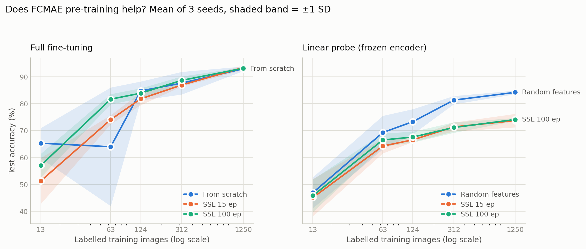
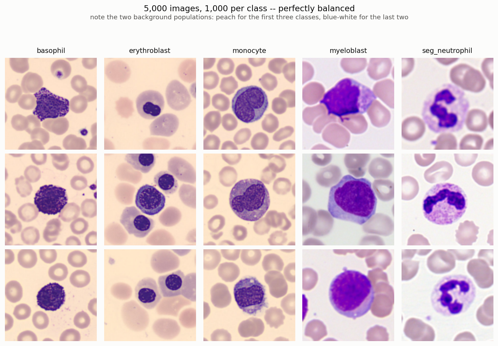
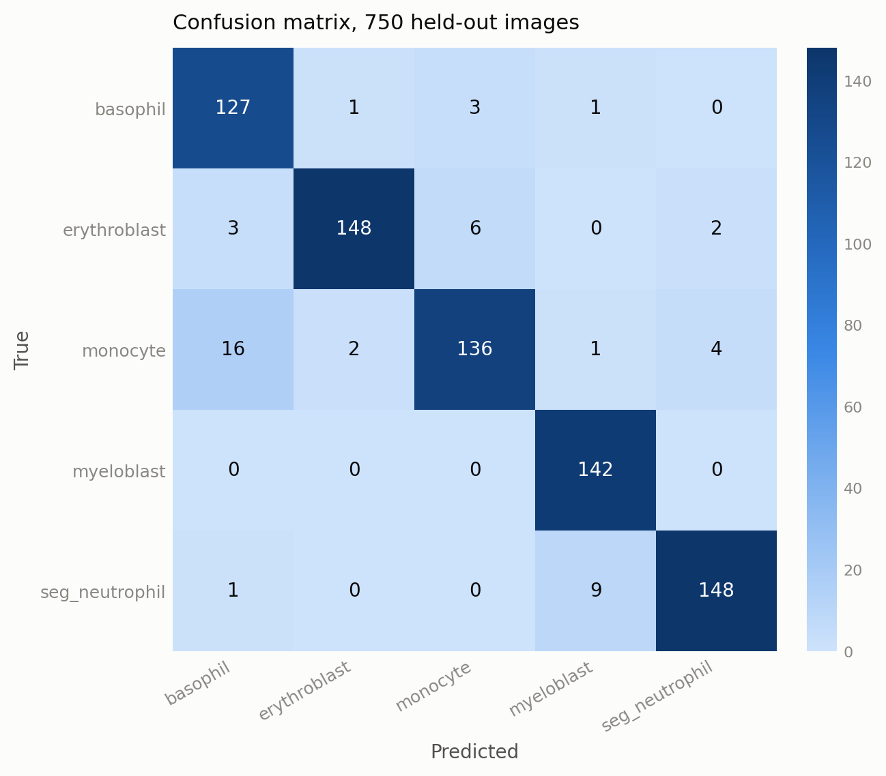
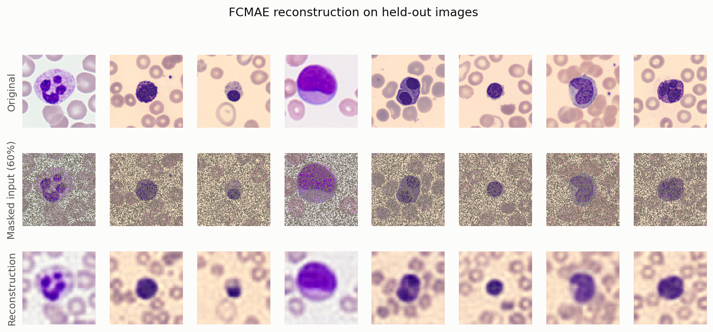

# ConvNeXt V2 + FCMAE from scratch, on blood cell microscopy

A ConvNeXt V2 encoder and a masked-autoencoder pre-training pipeline, implemented
from scratch in PyTorch — no `timm`, no pre-trained weights — and applied to a
five-class blood cell classification task.

This started as a graduate deep-learning course project that reported **94.8%
test accuracy** and concluded that self-supervised pre-training had improved
generalization. The project was submitted and graded. I then re-opened it and ran
the controls it never had: a from-scratch baseline, a linear probe, a random-feature
control, a label-budget sweep, and three seeds throughout.

The controls changed the conclusions. All three findings below come from the same
fixed 750-image test set.

---

## Findings

**1. At full label budget, pre-training makes no measurable difference.**
93.38 ± 0.85% with pre-training vs **92.93 ± 0.87% from scratch** (3 seeds). The
ranges overlap almost completely. The original 94.8% was a single unseeded run —
seed-to-seed spread here is ±0.9 points, so one number could never have supported
the claim.

**2. Pre-training does help, but only in a narrow band of label scarcity — and it
buys stability more than accuracy.** At 63 labelled images (5%), training from
scratch is erratic: one of three seeds collapsed to 38.5% while the others reached
76–77%. Pre-training removes the collapse, and its *worst* seed (79.6%) beats the
*best* from-scratch seed (77.5%). At 13 images the effect reverses and pre-training
is clearly worse.

**3. The features are worse than random.** Under a linear probe, a frozen
**randomly-initialised** encoder reaches 84.18 ± 0.67%, while the frozen
FCMAE-pre-trained encoder reaches only 73.69 ± 2.50%. So whatever pre-training
contributes in finding 2 is a better optimization starting point, not a more
linearly-separable representation.

<picture>
  <source media="(prefers-color-scheme: dark)" srcset="results/figures/label_efficiency_dark.png">
  
</picture>

### And a control that reframes all of the above

Before crediting any of these numbers to representation learning, it is worth
asking how hard the benchmark actually is. A multinomial logistic regression on a
**48-dimensional RGB colour histogram** — no spatial information, no morphology,
no neural network — was trained on the same 1,250 images and evaluated on the same
750:

| Features | Dims | Test accuracy |
|---|---|---|
| Mean RGB of the whole image | 3 | 70.27% |
| Mean RGB of the four **corners** (background only) | 12 | 47.07% |
| **RGB histogram, 16 bins per channel** | **48** | **94.40%** |
| Image crushed to 8×8 | 192 | 88.00% |
| *Permutation control (shuffled labels)* | 48 | *20.00%* |

Chance is 20%. **A colour histogram matches the deep model** — and matches the
94.8% the original project reported. Even the four background corners, which
contain no cell at all, carry more than twice chance.

The dataset makes this visible: three classes are stained on a peach field and two
on a blue-white one, consistently.

<picture>
  <source media="(prefers-color-scheme: dark)" srcset="results/figures/dataset_overview_dark.png">
  
</picture>

So the headline accuracy in the original report was not evidence of morphological
understanding, and this benchmark cannot distinguish a model that reads cell
structure from one that reads staining colour. That is a property of the dataset,
not of the architecture — but it is the kind of thing a single accuracy number
hides. See [`src/shortcut_check.py`](src/shortcut_check.py).

---

## Results in full

Test accuracy (%), mean ± SD over 3 seeds, on the same held-out 750 images.
Machine-readable versions: [`summary.csv`](results/metrics/summary.csv),
[`summary.md`](results/metrics/summary.md), raw per-run records in
[`sweep.json`](results/metrics/sweep.json).

### Full fine-tuning

| Labelled images | From scratch | FCMAE 15 ep | FCMAE 100 ep |
|---|---|---|---|
| 13 (1%) | **65.29 ± 5.64** | 51.24 ± 8.52 | 56.98 ± 4.36 |
| 63 (5%) | 63.96 ± 22.03 | 74.04 ± 1.68 | **81.64 ± 1.89** |
| 124 (10%) | **84.71 ± 3.51** | 81.78 ± 2.34 | 83.87 ± 1.83 |
| 312 (25%) | 87.60 ± 4.20 | 86.89 ± 0.54 | **88.62 ± 1.46** |
| 1250 (100%) | 92.93 ± 0.87 | **93.38 ± 0.85** | 93.11 ± 0.38 |

### Linear probe (encoder frozen, 5-way head only)

| Labelled images | Random features | FCMAE 15 ep | FCMAE 100 ep |
|---|---|---|---|
| 63 (5%) | **69.24 ± 6.22** | 64.22 ± 2.70 | 66.49 ± 2.46 |
| 312 (25%) | **81.29 ± 1.54** | 71.33 ± 1.67 | 71.11 ± 1.95 |
| 1250 (100%) | **84.18 ± 0.67** | 73.69 ± 2.50 | 74.09 ± 0.54 |

The `Random features` column is the control that makes the probe interpretable: a
frozen random ConvNeXt is not a trivial feature extractor, so a probe score means
nothing without it.

### Where the errors go

<picture>
  <source media="(prefers-color-scheme: dark)" srcset="results/figures/confusion_matrix_dark.png">
  
</picture>

From a single seeded end-to-end run ([`src/reproduce.py`](src/reproduce.py), 93.47%,
macro-F1 0.934, macro-AUC 0.992). **40 of the 49 errors (82%) fall between classes
that share a background tint**, and myeloblast — the class that carries the cancer
signal, and one of the two on the blue-white field — is classified perfectly
(142/142). The largest single confusion is monocyte → basophil (16), both on peach.

A perfect recall on the clinically critical class reads as a strong result. Read
next to the colour-histogram control, it is better treated as a question about the
benchmark than as an achievement of the model.

---

## What is faithful to the paper, and what is not

The **architecture** is a faithful from-scratch implementation of ConvNeXt V2,
including Global Response Normalization — the component that distinguishes V2 from
V1. The **pre-training framework** is a deliberate simplification of FCMAE, carried
over unchanged from the original submission:

| Component | Paper (FCMAE) | This repo |
|---|---|---|
| GRN, ConvNeXt block, hierarchical encoder | ✅ | ✅ implemented from scratch |
| Masking granularity | 32×32 patches | per-pixel i.i.d. |
| Encoder convolutions | sparse submanifold | dense |
| Reconstruction loss | masked regions only | whole image |
| Decoder | 1 block, dim 512 | 4-stage ConvTranspose stack |
| Pre-training length | 800–1600 epochs | 15 and 100 epochs |

These gaps matter for interpreting finding 3, and the reconstruction figure shows
why: at 60% *per-pixel* masking the cell is still plainly visible, so a 7×7
depthwise convolution can interpolate the missing pixels from their neighbours
without learning anything about cells.

<picture>
  <source media="(prefers-color-scheme: dark)" srcset="results/figures/ssl_reconstruction_dark.png">
  
</picture>

Full detail, including the naming correction (the encoder is ConvNeXt V2 **Atto**,
not Nano as the original report said) and the three deviations from the submitted
notebook, is in [`docs/implementation_notes.md`](docs/implementation_notes.md).

---

## Setup

**Dataset.** [`sumithsingh/blood-cell-images-for-cancer-detection`](https://www.kaggle.com/datasets/sumithsingh/blood-cell-images-for-cancer-detection)
— 5,000 microscopy images, exactly 1,000 per class, five classes: basophil,
erythroblast, monocyte, myeloblast, seg_neutrophil. Downloaded automatically via
`kagglehub` (no credentials needed), resized to 128×128, and cached once as a
single uint8 tensor so the 90-run sweep never re-decodes a JPEG.

**Splits.** One fixed partition, generated with a fixed seed and identical across
every condition and every run: 2,500 unlabelled for pre-training / 1,250 supervised
train / 500 validation / 750 test. Label-budget subsets are drawn **stratified** —
at 1% (13 images across 5 classes) uniform sampling can drop a class entirely.

**Model.** ConvNeXt V2 Atto, depths `[2,2,6,2]`, dims `[40,80,160,320]`,
3,386,760 parameters, trained from random initialization throughout.

**Training.** AdamW. Pre-training: lr 1e-3, wd 0.05, mask ratio 0.6. Fine-tuning:
lr 5e-4, wd 1e-4, dropout 0.5, early stopping on validation loss (patience 5), best
weights restored before the single test evaluation. Linear probes use lr 1e-3 since
only the head trains. No data augmentation — matching the submitted code.

---

## Reproducing

```bash
pip install -r requirements.txt

# Reproduce the original pipeline end to end + all qualitative figures   (~3 min)
python -m src.reproduce --seed 0

# The colour-shortcut control, CPU only                                   (~1 min)
python -m src.shortcut_check

# The full study: 4 conditions x 5 label budgets x 3 seeds = 90 runs     (~30 min)
python -m src.experiments --seeds 0 1 2

# Figures and summary tables from the sweep records
python -m src.analyze
```

Timings are for an RTX 4060 Ti (8 GB); the first run spends ~1 extra minute
building the image cache. The sweep writes after every run and skips completed
cells, so it can be interrupted and resumed. A quick single-cell check:

```bash
python -m src.experiments --seeds 0 --fractions 1.0 --ssl-epochs 15
```

**On reproducibility:** every run seeds Python, NumPy and Torch, and the data split
is fixed. cuDNN kernel selection still leaves residual non-determinism on GPU, so
re-runs move by a few tenths of a point. The mean ± SD over three seeds is the
quantity to compare, not any single number — which is the point of finding 1.

---

## Repository layout

```
src/
  model.py           LayerNorm, GRN, ConvNeXt V2 block, encoder, FCMAE, classifier
  data.py            download, in-memory cache, splits, stratified label subsets
  engine.py          pre-training / fine-tuning loops, early stopping, evaluation
  experiments.py     the 4-condition x 5-budget x 3-seed sweep
  shortcut_check.py  colour-only baselines + permutation control
  analyze.py         label-efficiency figure, summary tables
  reproduce.py       original pipeline end to end, all qualitative figures
  theme.py           shared plotting tokens (validated palette, light + dark)
results/
  figures/           every figure, in light and dark variants
  metrics/           sweep records, summaries, classification report, SSL loss curves
notebooks/
  original_submission.ipynb   the notebook as handed in, outputs intact
docs/
  implementation_notes.md     faithful vs. simplified, in detail
  report_fa.pdf               original 77-page report (Persian)
  slides_fa.pdf               original slides (Persian)
```

`results/metrics/sweep_lastepoch_snapshot.json` holds an earlier version of the
sweep in which the pre-trained encoder was snapshotted at the *last* epoch rather
than the lowest-loss one. With a constant learning rate and no warmup, the
100-epoch runs spike late — in 2 of 3 seeds the final epoch landed 10–15× above the
minimum reached around epoch 95 — which handed the downstream comparison a diverged
encoder. It is kept as provenance for why [`pretrain_ssl`](src/engine.py) selects
the lowest-loss snapshot instead.

---

## Limitations

- **One data split.** The test set is fixed rather than cross-validated, so the
  reported SD captures training stochasticity, not split variance.
- **No patient or slide grouping.** The dataset carries no slide identifiers, so
  near-duplicate crops from one source slide could straddle the split. This cannot
  be ruled out with the available metadata, and it would inflate every number here.
- **The pre-training is not FCMAE.** See the table above. A negative result about
  *this* pretext task is not a negative result about FCMAE.
- **Short pre-training.** 100 epochs against the paper's 800–1600.
- **No clinical validation.** These are benchmark metrics on a Kaggle dataset, not
  evidence of diagnostic utility.

## What I would do next

1. **Real FCMAE** — 32×32 patch masking, sparse submanifold convolutions, loss on
   masked regions only, the paper's lightweight asymmetric decoder. This is the one
   change that would make finding 3 a statement about FCMAE rather than about a
   pixel-denoising task.
2. **A stain-normalised or grayscale version of the benchmark**, to measure how much
   accuracy survives once the colour shortcut is removed.
3. **Cosine schedule with warmup** for pre-training, which is what makes long masked
   pre-training stable and would remove the late-epoch spikes documented above.

---

## Original submission

Course project for Deep Learning (M.Sc.), Department of Biomedical Engineering,
Amirkabir University of Technology (Tehran Polytechnic). Submitted and graded;
the report and slides are archived here unchanged, in Persian. Where the report and
this repository disagree — the "Nano"/Atto naming, the augmentation description, and
the reproducibility claim — the repository is correct and the discrepancies are
listed in [`docs/implementation_notes.md`](docs/implementation_notes.md).

## References

1. S. Woo, S. Debnath, R. Hu, X. Chen, Z. Liu, I. S. Kweon, S. Xie. *ConvNeXt V2:
   Co-designing and Scaling ConvNets with Masked Autoencoders.* CVPR 2023.
   [arXiv:2301.00808](https://arxiv.org/abs/2301.00808)
2. Z. Liu, H. Mao, C.-Y. Wu, C. Feichtenhofer, T. Darrell, S. Xie. *A ConvNet for
   the 2020s.* CVPR 2022. [arXiv:2201.03545](https://arxiv.org/abs/2201.03545)
3. K. He, X. Chen, S. Xie, Y. Li, P. Dollár, R. Girshick. *Masked Autoencoders Are
   Scalable Vision Learners.* CVPR 2022. [arXiv:2111.06377](https://arxiv.org/abs/2111.06377)

## License

MIT — see [LICENSE](LICENSE). The dataset is redistributed by its authors on Kaggle
under their own terms and is not included here.
